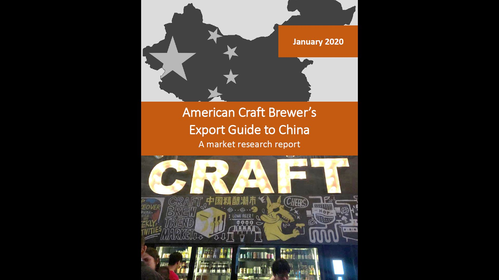
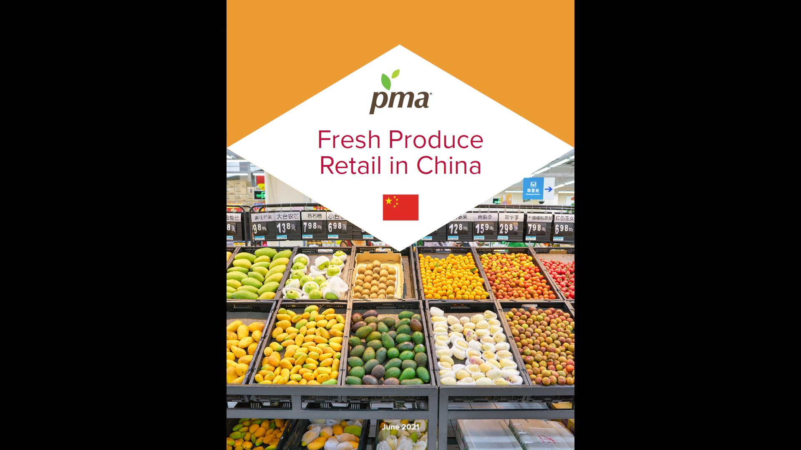

### Knowledge is Power

MZMC conducts in-depth research and intelligence reporting to support evidence-based marketing, track KPIs, and help clients optimize for impact.

We combine extensive knowledge of China's food and agriculture markets with rigorous research methodologies and a passion to understand. The result is better returns for our clients and strategies designed for long-term success.

#### What we examine

<i class="fa fa-check"></i> Regulatory environment

<i class="fa fa-check"></i> Supply chain bottlenecks and pain points

<i class="fa fa-check"></i> Retail and consumer trends across regions and demographics

<i class="fa fa-check"></i> Competing products and suppliers

<i class="fa fa-check"></i> Economic and price trends

<i class="fa fa-check"></i> Label requirements and permissible claims

 

#### How we do it

Our research services employ quantitative and qualitative analyses informed by desk research, expert interviews, and field visits to critical points in the supply chain. We use manual search and tech-enabled tools to extract metrics for products, prices, and sellers from popular e-commerce platforms. We identify and interview leading importers, distributors, retailers, industry associations, and government regulators. We conduct field visits to border ports, free trade zones, logistics hubs, retailers, and foodservice outlets. We work with global leaders in consumer survey research to understand the habits and preferences of China's consumers relevant to specific products.

#### Recent reports

    <a class="report" href="https://connecting-asia.org/activities/tropical-fresh-fruit-exporters-guide-to-china-for-agri-businesses-from-cambodia-lao-pdr-and-vietnam/" target="_blank">
        
        

            
Tropical Fresh Fruit Exporter’s Guide to China for Agri-Businesses from Cambodia, Lao PDR, and Vietnam

        

    </a>
    <a class="report" href="https://www.brewersassociation.org/programs/join-the-edp/" target="_blank">
        
        

            
American Craft Brewer's Export Guide to China (BA member exclusive)

        

    </a>
    <a class="report" href="https://www.freshproduce.com/resources/global-trade/2021-fresh-produce-retail-in-china/" target="_blank">
        
        

            
2021 Fresh Produce Retail in China (PMA member exclusive)

        

    </a>

<!-- 

#### Case studies

* Read about how we helped introduce Chinese consumers to cranberries

* Read about how we helped introduce Chinese consumers to pecans

* Read about how we support Chile's $1b cherry trade with China

* Read about how we helped introduce China to craft beer

#### Deliverables

The most effective marketing strategies are built upon deep, nuanced understanding of both the product and the target market. Our research reports provide

1. A comprehensive overview of the China market including actionable recommendations for exporters, brand managers, regulators, industry associations, growers, manufacturers, and other stakeholders

2. Data from which to inform evidence-based activities and objectively guague progress toward market development goals

3. Database of vetted trade contacts

-->