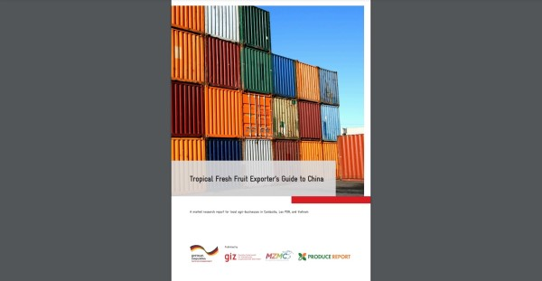

### Knowledge Is Power

MZMC delivers in-depth research and market intelligence to support evidence-based strategy, KPI tracking, and performance optimization.

We combine long-standing knowledge of China’s food and agriculture landscape with rigorous, field-tested research methodologies and a commitment to understanding how markets function in practice. The result is clearer decision-making, stronger returns on investment, and strategies built for long-term success.

#### What We Examine

<i class="fa fa-check"></i> Regulatory frameworks and market access requirements

<i class="fa fa-check"></i> Supply chain structure, bottlenecks, and points of friction

<i class="fa fa-check"></i> Retail, e-commerce, and consumer trends across regions and demographics

<i class="fa fa-check"></i> Competitive landscape, including products, suppliers, and channels

<i class="fa fa-check"></i> Macroeconomic conditions and price dynamics

<i class="fa fa-check"></i> Labeling standards and permissible claims

 

#### How We Work

Our specialists integrate quantitative and qualitative analysis, combining structured desk research with expert interviews and on-the-ground fieldwork at critical points in the value chain.

We extract product, pricing, and seller data from major e-commerce platforms using a hybrid methodology that blends manual validation with advanced analytical tools. We engage directly with importers, distributors, retailers, industry associations, and regulators to test assumptions and verify market realities.

Our field research spans border ports, free-trade zones, logistics hubs, retail environments, and foodservice channels. In parallel, we collaborate with leading global consumer research firms to generate statistically robust insights into purchasing behavior and product perception in China.

#### Recent reports

    <a class="report" href="https://connecting-asia.org/activities/tropical-fresh-fruit-exporters-guide-to-china-for-agri-businesses-from-cambodia-lao-pdr-and-vietnam/" target="_blank">
        
        

            
Tropical Fresh Fruit Exporter’s Guide to China for Agri-Businesses from Cambodia, Lao PDR, and Vietnam

        

    </a>
    <a class="report" href="https://www.brewersassociation.org/programs/join-the-edp/" target="_blank">
        
        

            
American Craft Brewer's Export Guide to China (BA member exclusive)

        

    </a>
    <a class="report" href="https://www.freshproduce.com/resources/global-trade/2021-fresh-produce-retail-in-china/" target="_blank">
        
        

            
2021 Fresh Produce Retail in China (PMA member exclusive)

        

    </a>

<!-- 

#### Case studies

* Read about how we helped introduce Chinese consumers to cranberries

* Read about how we helped introduce Chinese consumers to pecans

* Read about how we support Chile's $1b cherry trade with China

* Read about how we helped introduce China to craft beer

#### Deliverables

The most effective marketing strategies are built upon deep, nuanced understanding of both the product and the target market. Our research reports provide

1. A comprehensive overview of the China market including actionable recommendations for exporters, brand managers, regulators, industry associations, growers, manufacturers, and other stakeholders

2. Data from which to inform evidence-based activities and objectively guague progress toward market development goals

3. Database of vetted trade contacts

-->
